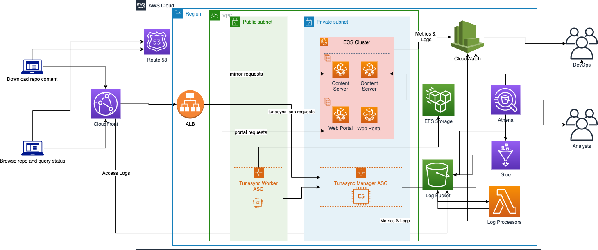

# Open TUNA project!

This is the infrastructure project of Open TUNA on AWS, orchestrated by [AWS CDK][aws-cdk].

See below for the overall architecture,


It consists of the following independent [stacks][cfn-stack],

- Network stack(optional)
  - Create a dedicated VPC with public and private subnets across three AZs with NAT gateways
  - Create S3 Endpoint
- Storage stack(optional)
  - EFS file system
- Common stack
  - SNS notification topic
  - Slack webhook subscription(optional)
- Open TUNA stack
  - S3 asset bucket
  - application load balancer
  - CloudFront distribution
  - log analysis for CloudFront distribution
  - ECS cluster for content server and web portal
  - issue SSL certificate from ACM(only for using Route53 as DNS resolver)
  - create DNS record in R53 for ALB and CloudFront(only for using Route53 as DNS resolver)
  - invalidate CloudFront cache when content updates
  - S3 buckets for S3-backed repos e.g. rubygems
  - Tunasync Manager stack
    - auto scaling group for [tunasync][tunasync] manager
    - intranet application load balancer for manager's API
    - elasticache redis cluster for database storage
  - Tunasync Worker stack
    - auto scaling group for [tunasync][tunasync] worker
    - install necessary third party tools for mirroring tasks
    - use systemctl as daemon to start tunasync worker
    - send custom CloudWatch metrics of tunasync process info
    - publish large configuration files to s3 asset bucket
  - Content Server stack
    - build custom nginx container
    - use Fargate service to serve mirror contents
    - internet facing application load balancer
    - collect network metrics by CloudWatch agent
    - setup auto scaling rules based on metrics
  - Web Portal stack
    - use tuna/mirror-web
    - route tunasync.json to tunasync manager
    - create and run lambda function periodically to generate iso download links
  - Monitor stack
    - create several CodeBuild projects to verify integrity of index files
    - run projects periodically and report upon failure
    - trigger re-sync when failure is detected
  - Certificate stack
    - create CodeBuild project to manual renew Let's Encrypt certificate
- [Pipeline stack](pipeline.md)

## Prerequisites

- VPC with both public and private subnets crossing two AZs at least and NAT gateway. You can [deploy the network stack](#deploy-network-stackoptional) if you don't have a VPC which satisfies the requirements.
- EFS file system associated with above VPC. You can deploy stack with provisioning a EFS file system without specifying the existing filesystem id of EFS.

## How to deploy it

### Prerequisites

- An AWS account
- Configure [credential of aws cli][configure-aws-cli]
- Install node.js LTS version, such as 12.x
- Install npm 7.x
- Install Docker Engine

### Checkout submodules

```shell
git submodule init
git submodule update
```

### Install project dependencies

```shell
npm run init
```

### Deploy network stack(optional)

```shell
npm run deploy-network
```

### Deploy storage stack(optional)

```shell
npx cdk deploy OpenTunaStorageStack -c vpcId=<existing vpc Id>
```

### Deploy open tuna stack

```shell
# deploy storage and common stack as well
npx cdk deploy OpenTunaStack -c vpcId=<existing vpc Id>

# subscribe SNS topic alaram to slack channel
# Go to https://slack.com/apps/A0F7XDUAZ-incoming-webhooks to apply for webhook
npx cdk deploy OpenTunaStack -c vpcId=<existing vpc Id> -c slackHookUrl=<webhook url>

# or deploy with existing EFS filesystem
npx cdk deploy OpenTunaStack -c vpcId=<existing vpc Id> -c fileSystemId=<existing filesystem id> -c fileSystemSGId=<existing sg id of the given file system>

# deploy with domain name and use Route53 as DNS resolver
npx cdk deploy OpenTunaStack -c vpcId=<existing vpc Id> -c domainName=<domain name of site> -c domainZone=<public hosted zone of your domain in Route53>

# deploy with SSL cert of CloudFront for China regions
# upload SSL cert to IAM, for China region only
aws iam upload-server-certificate --server-certificate-name my-domain --certificate-body file://cert.pem --private-key file://privkey.pem --certificate-chain file://chain.pem --path '/cloudfront/'
# get cert id from above output
npx cdk deploy OpenTunaStack -c vpcId=<existing vpc Id> -c domainName=<domain name of site> -c domainZone=<public hosted zone of your domain in Route53> -c iamCertId=<cert id>
```

The `CertificateStack` will be created when using IAM cert for the CloudFront SSL. The stack will create a CodeBuild project to issue new SSL certificates from Let's encrypt. And the build event can be pushed to the pipeline account when deploying the stack via the below context option,

```
-c certTopicArn=<arn of sns topic created by pipeline stack>
```

Docker image for content server is automatically built and published. You can build and publish to ecr manually:

```bash
$ sudo docker build -t content-server:1.18-alpine .
$ sudo docker tag content-server:1.18-alpine ${uid}.dkr.ecr.${region}.amazonaws.com/content-server:1.18-alpine
$ sudo docker push ${uid}.dkr.ecr.${region}.amazonaws.com/content-server:1.18-alpine
```

## How to test

```shell
npm run test
```

## Post deployment
- Add email addresses or other subscribers to the notification topic created in the common stack. The alarm notifications related to Open TUNA will be sent to those subscribers.

[aws-cdk]: https://aws.amazon.com/cdk/
[cfn-stack]: https://docs.aws.amazon.com/AWSCloudFormation/latest/UserGuide/stacks.html
[configure-aws-cli]: https://docs.aws.amazon.com/zh_cn/cli/latest/userguide/cli-chap-configure.html
[tunasync]: https://github.com/tuna/tunasync
