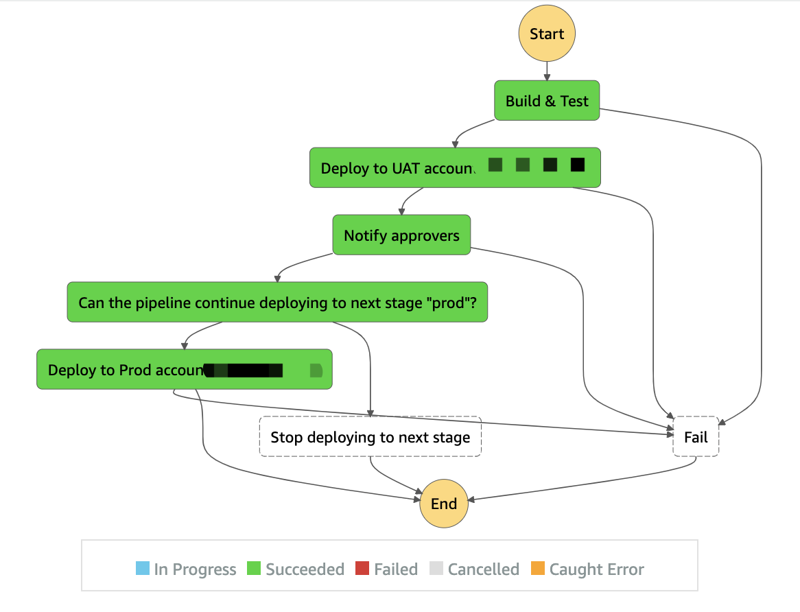

# OpenTUNA Pipeline

OpenTUNA pipeline is a DevOps process to deploy OpenTUNA across accounts/regions for multiple stages.

See below deployment workflow grahic,


## Prerequisites
- Create deployment IAM role that trusted deployment account, run below command against `UAT` and `PROD` account
```sh
npm run deploy-pipeline-cross-account-setup -- -c trustedAccount=<account id running the pipeline>
```
- [AWS CLI](https://docs.aws.amazon.com/cli/latest/userguide/cli-chap-install.html) installed
- Create configuration parameters for different stages in [SSM parameter store](https://docs.aws.amazon.com/systems-manager/latest/userguide/systems-manager-parameter-store.html). The stage configuration is a json string, which looks like below,
```json
{
  "name": "UAT",
  "deployContexts": {
    "vpcId": "vpc-id",
    "iamCertId": "iam-cert-id",
    "domainName": "mydomain.com",
    "domainZone": "mydomain.com",
    "additionalOptions": ""
  },
  "assumeRoleContexts": {
    "account": "the account id to be deployed",
    "roleName": "role name created by cross account step"
  }
}
```
By default the parameter name is `/opentuna/pipeline/stage/uat` and `/opentuna/pipeline/stage/prod`.

## How to deploy it
```sh
npm run install-deps
npm run deploy-pipeline
```